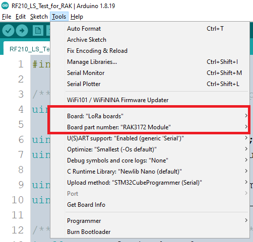

# RF210_LS_Test_for_RAK

An Arduino sketch example shows how to communicate with a terrestrial gateway and Lacuna satellite.
ABP activation mode is used for both terrestrial and space communication.
For testing simplicity, two different sets of credentials (dev address and keys) are used for terrestrial and space communication respectively.

# Board Manager

The example used [stm32duino/Arduino_Core_STM32](https://github.com/stm32duino/Arduino_Core_STM32). Refer to this [Getting Started](https://github.com/stm32duino/Arduino_Core_STM32#getting-started) for installation guide of this core.

To compile the example, select board manager as followings in ArduinoIDE



# Libraries

The sketch required following libraries. Make sure you have them installed:

| **Header Included** |                   **Library Reposistory**                   |
|:-------------------:|:-----------------------------------------------------------:|
| RFThings.h          | https://github.com/nguyenmanhthao996tn/LoRaSpaceLib-STM32WL |
| STM32LowPower.h     | https://github.com/stm32duino/STM32LowPower                 |
| STM32RTC.h          | https://github.com/stm32duino/STM32RTC                      |
| Sgp4.h              | https://github.com/Hopperpop/Sgp4-Library                   |
| MicroNMEA.h         | https://github.com/stevemarple/MicroNMEA                    | 

# Two Line Element Set (TLE)

TLE data in ```tle.h``` file has to be updated with recent TLE from the targeted satellite to avoid pass predicting error.

TLE data & other information could be find by contacting Satellite provider or the following table:

| **Satellite** | **Norad ID** |                 **TLE & Satellite info**                 |
|:-------------:|:------------:|:---------------------------------------:|
|  LACUNASAT-2B |     47948    | https://www.n2yo.com/satellite/?s=47948 |
|     _..._     |     _..._    |       _(More satellite is coming)_      |

# Configuration files

LoRaWAN credentials are defined in ```project_config.h``` for terrestrial and space terminals. These values need to be updated with your own application / network server.

For terrestrial communication:

|    **In ```project_config.h```**    | **Abbreviation** |     **Description**     |
|:-----------------------------------:|:----------------:|:-----------------------:|
|     ```nwkS_key_terrestrial[]```    |      DevAddr     |      Device address     |
|     ```appS_key_terrestrial[]```    |      AppSKey     | Application Session Key |
|     ```dev_addr_terrestrial[]```    |      NwkSKey     |   Network Session Key   |

For space communication:

| **In ```project_config.h```** | **Abbreviation** |     **Description**     |
|:-----------------------------:|:----------------:|:-----------------------:|
|     ```nwkS_key_space[]```    |      DevAddr     |      Device address     |
|     ```appS_key_space[]```    |      AppSKey     | Application Session Key |
|     ```dev_addr_space[]```    |      NwkSKey     |   Network Session Key   |

For other configurations, refer to [**project_config_h.md**](./project_config_h.md).

# Cautions for actual deployment

For actual deployment of the terminal/device, following debugging configurations **SHOULD be disabled** to reduced power consumption.

- SERIAL_LOG_ENABLE
- SERIAL_LOG_DEBUG_ENABLE
- SYSTEM_SLEEP_DEBUG

This example is design for The RAK3172 module integrated on RFThings RF210 to work independently. The integrated ESP32-C3 should be also put into sleep mode to maximize the device's battery lifetime.

# Payload format

The uplink payload format remains the same for terrestrial and space communication. Payload's length should be always **25 bytes**. An example of packet decoder in Javascript can be find in [docs/packet_formatter_ttn.js](./docs/packet_formatter_ttn.js)

|   **Payload**  |              **Description**              |                      **Value**                      |
|:--------------:|:-----------------------------------------:|:---------------------------------------------------:|
| payload[**0**]     | Is this packet sent to satellite?         | **1**: Send to satellite<br />**0**: Send to terrestrial gateway |
| payload[**4:1**]   | Packet build epoch                        | N/A                                                 |
| payload[**8:5**]   | Device last latitude                      | N/A                                                 |
| payload[**12:9**]  | Device last longtitude                    | N/A                                                 |
| payload[**16:13**] | Next satellite pass start epoch           | N/A                                                 |
| payload[**20:17**] | Next satellite pass duration in second(s) | N/A                                                 |
| payload[**24:21**] | Next GPS update epoch                     | N/A                                                 |

# Credits

Communication with :satellite: satellites :satellite: from small terminal/device is challenging but not too hard. Stick with us at [RFThings Support eMail](mailto:support@rfthings.com.vn?subject=Question%20of%20RF210_LS_Test_for_RAK) in this adventure and we can make it there.

🍀 GLHF! 🍀

---

##### :satellite: :space_invader: :beer: Maintained by Prof. F. Ferrero & RFTHINGS CO.,LTD :satellite: :space_invader: :beer:
